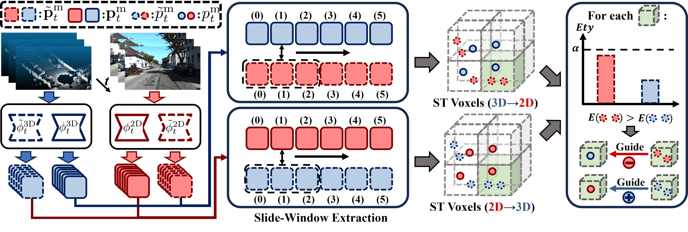

<h1 align="center">Reliable Spatial-Temporal Voxels for Multi-Modal Test-Time Adaptation</h1>

<p align="center"><strong>
    <a href = "https://sites.google.com/view/haozhicao">Haozhi Cao</a><sup>1</sup>,
    <a href = "https://xuyu0010.wixsite.com/xuyu0010">Yuecong Xu</a><sup>2</sup>,
    <a href = "https://marsyang.site/">Jianfei Yang</a><sup>3*</sup>,
    <a href = "https://pamphlett.github.io/">Pengyu Yin</a><sup>1</sup>,
    <a href = "https://scholar.google.com/citations?user=qcLKoccAAAAJ&hl=en">Xingyu Ji</a><sup>1</sup>,
    <a href = "https://scholar.google.com/citations?user=XcV_sesAAAAJ&hl=en">Shenghai Yuan</a><sup>1</sup>,
    <a href = "https://scholar.google.com.sg/citations?user=Fmrv3J8AAAAJ&hl=en">Lihua Xie</a><sup>1</sup>
</strong></p>

<p align="center"><strong>
    <a href = "https://www.ntu.edu.sg/cartin">1: Centre for Advanced Robotics Technology Innovation (CARTIN), Nanyang Technological University</a><br>
    <a href = "https://cde.nus.edu.sg/ece/">2: Department of Electrical and Computer Engineering, National University of Singapore</a><br>
    <a href = "https://www.ntu.edu.sg/mae">3: School of MAE</a> and <a href = "https://www.ntu.edu.sg/eee">School of EEE</a>, Nanyang Technological University<br>
</strong></p>

<p align="center"><strong> 
    <a href = "https://arxiv.org/abs/2403.06461">&#128196; [Arxiv]</a> | 
    <a href = "https://sites.google.com/view/eccv24-latte">&#128190; [Project Site]</a> |
    &#128214; [OpenAccess]
</strong></p>

## :scroll: About Latte (ECCV 2024)

**Latte** is an MM-TTA method that leverages estimated 3D poses to retrieve reliable spatial-temporal voxels for Test-Time Adaptation (TTA). The overall structure is as follows.

<p align="middle">
  
</p>


## Installation and Prerequisite

To ease the effort during environment setup, we recommend you leverage [Docker](https://www.docker.com/) and [NVIDIA Container Toolkit](https://docs.nvidia.com/ai-enterprise/deployment-guide-vmware/0.1.0/docker.html). With Docker installed, you can locally build the docker image for Latte using [this Dockerfile](Dockerfile) by running ```docker build -t latte .```.

You can then run a container using the docker image. The next step is to install some additional prerequisites. To do so, go to this repo folder and run ```bash install.sh``` within the built container (you may ignore the warning saying some package versions are incompatible).


## Dataset Preparation
Please refer to [DATA_PREPARE.md](latte/data/DATA_PREPARE.md) for the data preparation and pre-processing details.


## Pretraining and Test-Time Adaptation
We recommand you to create a directory for logs and checkpoints saving, and then link to this repo by ```mkdir latte/exp & ln -sfn /path/to/logs/checkpoints latte/exp/models```
### Pretraining
To get the pretrained model, the easiest way is to 
1. Download our prepared multi-modal networks from the googld drive links provided in the main result table. 
2. Then update the ```MODEL_2D.CKPT_PATH``` and ```MODEL_3D.CKPT_PATH``` in each TTA methods configs to proceed the TTA proecess. 

You can also create your own pretrained models, first download the pretrained checkpoint ```segformer.b1.512x512.ade.160k.pth``` from [their official repo](https://github.com/NVlabs/SegFormer), and move it to ```latte/models/pretrained/```. Then run the followed command:

```bash
# Taking S-to-S as an example
$ CUDA_VISIBLE_DEVICES=0 python latte/train/train_baseline.py --cfg=configs/synthia_semantic_kitti/baseline.yaml
```

Do note that you need to specify your GPU id in the env variable by using ```CUDA_VISIBLE_DEVICES=0```.

### Test-Time Adaptation
After updated the paths to corresponding pretrained checkpoints, you can conduct test-time adaptation using the respective config, taking Latte as an example:
```bash
# Taking S-to-S as an example
$ CUDA_VISIBLE_DEVICES=0 python latte/tta/tta.py --cfg=configs/synthia_semantic_kitti/latte.yaml
```
After the TTA process, class-wise results will be recorded in the ```*.xlsx``` file located in the model directory ```latte/exp/models/RUN_NAME```. The following table contains the overall results of each method we compared as well as Latte, and links to our pretrained checkpoints.

<table border="1" align="center">
  <tr>
    <td rowspan="2" valign="center">Method</td>
    <td rowspan="2" valign="center">MM</td>
    <td colspan="3" align="center">
      USA&#8594;Singapore <br> <a href="https://drive.google.com/drive/folders/1Kfa0uPrgzMbI7AzEZi5f02fUzcAR43fO?usp=sharing">(checkpoints)</a>
    </td>
    <td colspan="3" align="center">
      A2D2&#8594;KITTI <br> <a href="https://drive.google.com/drive/folders/12fYs8QTKgqtuT2qe3qlyR6tLPfN6SD6D?usp=sharing">(checkpoints)</a>
    </td>
    <td colspan="3" align="center">
      Synthia&#8594;KITTI <br> <a href="https://drive.google.com/drive/folders/1iQJnTS8QBDw7OmlHuc_pRtmTQGLlQBhy?usp=sharing">(checkpoints)</a>
    </td>
  </tr>
  <tr>
    <!-- U-to-S -->
    <th align="center">2D</th> <th align="center">3D</th> <th bgcolor="grey" align="center">xM</th>
    <!-- D-to-N -->
    <th align="center">2D</th> <th align="center">3D</th> <th bgcolor="grey" align="center">xM</th>
    <!-- A-to-S -->
    <th align="center">2D</th> <th align="center">3D</th> <th bgcolor="grey" align="center">xM</th>
    <td bgcolor="grey" align="center">
      Avg
    </td>
  </tr>
  <tr>
    <td>TENT</td> <td>&#10008</td> 
    <td>36.8</td> <td>36.5</td> <td bgcolor="grey">42.1</td> 
    <td>43.3</td> <td>44.4</td> <td bgcolor="grey">49.1</td> 
    <td>22.4</td> <td><u>35.2</u></td> <td bgcolor="grey"><u>37.3</u></td> 
    <td bgcolor="grey">42.8</td> 
  </tr>
  <tr>
    <td>ETA</td> <td>&#10008</td>
    <td>36.8</td> <td>34.2</td> <td bgcolor="grey">43.5</td> 
    <td>43.2</td> <td>42.4</td> <td bgcolor="grey">49.8</td> 
    <td>22.4</td> <td>30.6</td> <td bgcolor="grey">32.9</td> 
    <td bgcolor="grey">42.1</td> 
  </tr>
  <tr>
    <td>SAR</td> <td>&#10008</td>
    <td>36.7</td> <td>35.7</td> <td bgcolor="grey">43.8</td> 
    <td>43.2</td> <td>44.5</td> <td bgcolor="grey">50.3</td> 
    <td>21.1</td> <td>32.2</td> <td bgcolor="grey">34.1</td> 
    <td bgcolor="grey">42.7</td> 
  </tr>
  <tr>
    <td>SAR-rs</td> <td>&#10008</td>
    <td>36.7</td> <td>34.8</td> <td bgcolor="grey">43.7</td> 
    <td>43.3</td> <td>43.1</td> <td bgcolor="grey">49.9</td> 
    <td>22.2</td> <td>30.6</td> <td bgcolor="grey">32.8</td> 
    <td bgcolor="grey">42.1</td> 
  </tr>
  <tr>
    <td>xMUDA</td> <td>&#10004</td>
    <td>20.3</td> <td>36.4</td> <td bgcolor="grey">33.6</td> 
    <td>13.0</td> <td>33.2</td> <td bgcolor="grey">21.3</td> 
    <td>8.4</td> <td>22.2</td> <td bgcolor="grey">18.9</td> 
    <td bgcolor="grey">21.6</td> 
  </tr>
  <tr>
    <td>xMUDA+PL</td> <td>&#10004</td>
    <td>36.5</td> <td>40.8</td> <td bgcolor="grey">45.4</td> 
    <td>42.7</td> <td>48.3</td> <td bgcolor="grey">50.9</td> 
    <td>28.2</td> <td>32.6</td> <td bgcolor="grey">34.5</td> 
    <td bgcolor="grey">43.6</td> 
  </tr>
  <tr>
    <td>MMTTA</td> <td>&#10004</td>
    <td>37.2</td> <td><b>41.6</b></td> <td bgcolor="grey"><u>45.6</u></td> 
    <td><u>44.4</u></td> <td><u>50.6</u></td> <td bgcolor="grey"><u>52.3</u></td> 
    <td>27.3</td> <td>33.5</td> <td bgcolor="grey">34.4</td> 
    <td bgcolor="grey"><u>44.1</u></td> 
  </tr>
  <tr>
    <td>PsLabel</td> <td>&#10004</td>
    <td><b>37.7</b></td> <td>35.8</td> <td bgcolor="grey">41.7</td> 
    <td>42.8</td> <td>47.0</td> <td bgcolor="grey">49.4</td> 
    <td><u>29.5</u></td> <td>34.2</td> <td bgcolor="grey">36.5</td> 
    <td bgcolor="grey">42.5</td> 
  </tr>
  <tr>
    <td>Latte (Ours)</td> <td>&#10004</td>
    <td><u>37.5</u></td> <td><u>41.0</u></td> <td bgcolor="grey"><b>46.2</b></td> 
    <td><b>46.0</b></td> <td><b>53.0</b></td> <td bgcolor="grey"><b>54.2</b></td> 
    <td><b>33.3</b></td> <td><b>39.3</b></td> <td bgcolor="grey"><b>41.7</b></td> 
    <td bgcolor="grey"><b>47.4</b></td> 
  </tr>
</table>
<br>


## :eyes: Updates
* [2024.09] Release pretraining and TTA details. See you in Milan!
* [2024.09] Installation and data preparation details released. The full release will be available soon!
* [2024.08] We are now refactoring our code and code will be available shortly. Stay tuned!
* [2024.07] Our paper is accepted by ECCV 2024! Check our paper on arxiv [here](https://arxiv.org/abs/2403.06461).


## :clap: Acknowledgement
We greatly appreciate the contributions of the following public repos:
- [torchsparse](https://github.com/mit-han-lab/torchsparse)
- [SPVNAS](https://github.com/mit-han-lab/spvnas)
- [SegFormer](https://github.com/NVlabs/SegFormer) 
- [SalsaNext](https://github.com/TiagoCortinhal/SalsaNext)
- [KISS-ICP](https://github.com/PRBonn/kiss-icp)
- [xMUDA](https://github.com/valeoai/xmuda)

## :envelope: Contact
For any further questions, please contact Haozhi Cao (haozhi002@ntu.edu.sg)

## :pencil: Citation
```
@article{cao2024reliable,
  title={Reliable Spatial-Temporal Voxels For Multi-Modal Test-Time Adaptation},
  author={Cao, Haozhi and Xu, Yuecong and Yang, Jianfei and Yin, Pengyu and Ji, Xingyu and Yuan, Shenghai and Xie, Lihua},
  journal={arXiv preprint arXiv:2403.06461},
  year={2024}
}
```
